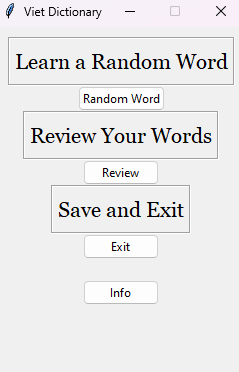

## My Vietnamese Dictionary
A GUI application to dynamically learn Vietnamese vocab by creating a personalized dictionary for users. 
Outputs an Excel spreadsheet of reviewed words for the user to easily access.
Built with Python using `tkinter` library.

### Screenshots

|  |  |  |
|:--------------------------------------------------:|:---------------------------------------------------------------:|:------------------------------------------------------------------:|
|                Image of Main Screen                |                      Image of Main Screen                       |                       Image of Review Screen                       |


## How to Use 

1. With Python installed, download the file "VietApp.py" into a desired folder.
- Or doing by Git, in your local terminal 
    ```bash
    git clone https://github.com/vinle0/Viet-App.git
    ```
- This will output a "Viet-App" folder containing the contents.
2. In the terminal, enter the following command.
    ```bash
    run VietApp.py
    ```

## Features
The project incorporates several software concepts:
- Web Scraping
  - `BeautifulSoup`
- API Access
  - `Bing Image Search Engine, freeDictionaryAPI`
    >   Note: the initial solution to search an image used a Google Search API. However,
  there were limitations as discussed [here](#limitations)
- Excel Manipulation
  - `openpyxl`
- Manipulating Operating Systems
  - `os, subprocess`
<!--Could place a collpased table here -->
<details>
<summary> Main Features</summary>

| Functions     | Description                                                                                                                                                                                                                                                                                                                                                                                                                                                                                                                                                                                                                                                                                                                             |
|---------------|-----------------------------------------------------------------------------------------------------------------------------------------------------------------------------------------------------------------------------------------------------------------------------------------------------------------------------------------------------------------------------------------------------------------------------------------------------------------------------------------------------------------------------------------------------------------------------------------------------------------------------------------------------------------------------------------------------------------------------------------| 
| `Random Word` | <br/> 1. Webscrapes from the [3000 most common words](https://www.ef.edu/english-resources/english-vocabulary/top-3000-words/)<br/><br/>2. Creates a local directory called _Images_ and  downloads an image into that directory. <br/><br/>3. Display the image and have the user guess the word.<br/><br/>4. User has the option to save the word to an Excel spreadsheet.<br/><br/>                                                                                                                                                                                                                                                                                                                                                        |
| `Review`      | <br/> 1. System creates a local called _Review_ directory  and creates a Excel spreadsheet called _Review.xlsx_<br/><br/> 2. Opens _Review.xlsx_ and show the user the <br/>following attributes in the `Notebook` widget of `tkinter`: <br/> <br/>**Picture:** Accesses the _Images_ directory and displays the image <br/> **Word:** Displays the English and Vietnamese Word<br/>**English:** Displays the English definition and example<br/>**Viet:** Displays the Vietnamese definition and example <br/><br/> 3. Traverse through the array by arrows or by entering a word<br/>- If it is a new word, create a new entry and append to the Excel spreadsheet. <br/>- If it is a word already entered in the Excel, go to that entry. <br/> <br/> |

</details>
<!--- Place individual and open excel here -->
Additionally, there are other features that are unique to translation
<details>
<summary> Supplemental Features </summary>

| Functions    | Description                                                                                                                                       |
|--------------|---------------------------------------------------------------------------------------------------------------------------------------------------| 
| `Individual` | Translates each word in the definition and example into individual Vietnamese words. Through `Notepad`, outputs the words as a Python `tempfile`. | 
| `Open Excel` | Access the _Review.xlsx_ to output words currently saved in _Review_ directory. Through `Notepad`, outputs the words as a Python `tempfile`.      |
| `Hint`       | Access the `freeDictionaryAPI` to get the definition of a given word.                                                                             |

</details>

### Limitations
There are several limitations/errors that would hinder the performance of the app.
* Initially used [Google Images Search API](https://pypi.org/project/Google-Images-Search/) to obtain higher quality images
and stricter guidelines for images.  
  * Utilized a personal API key in the `Google Custom Search API` library
  * Has the advantage of saving the Google Image to memory in a `BytesIO` object, which could have eliminated disk write/save
  to the _Images_ directory entirely.
  * However, as a cloud-based API, the maximum number of searches per day is only 100 searches.
    * `Bing Image Search Engine` allows unlimited downloads on images as an async url.
* Some words may not have an explicit definition/example and will result in an error in the Review windows
  * E.g., scenery
* Loading `Individual` translations and entering a word in the Review window has a slow time performance.
* When accessing `freeDictionaryAPI`, there are no synonyms. Thus, guessing the word has to be _exact._
* No functions to sort and delete entries in the Excel spreadsheet.
* All the words entered **have to be** in English; there is no checking in the Review windows if the entered word is correct.

## Reflection
This personal project came as an inspiration to learn more about Vietnamese in incorporating vocabulary. 
The objectives included self-learning Python and be acquainted with new concepts by reading documentation.

Originally, I wanted to use the `PyDictionary` to get a random word and have the user guess the word, but more often than not, the words
are random and are not common to the daily conversations. Thus, I began to look into web scraping for common words, learning HTML along the way.

Next is to find the GUI interface for the user, to which I learned from the documentation of the  `tkinter` library
and many of its geometry functions.

Accessing from the API of `Bing Search Image Engine`, I wanted to store images and access them from a locally 
created folder. Thus, I began to research more about command line interfaces (CLI) and the `os` and `subprocess` libraries. 

One of the main challenges was to store all the learned and saved words. To this end, I implemented an accessible Excel spreadsheet through the 
`openpyxl` library which would iterate through the sheet and append accordingly. In other words, one could build their 
own personalized phrase book.

As a personal project, I hope to develop not only my Vietnamese skills but also to learn programming in Python and 
be introduced to many data engineering concepts like web scraping, APIs, and command lines.

## Future Plans
Due to time constraints, there are still ways to go.
In addition to resolving the limitations [aforementioned above](#limitations), I hope to expand my dictionary to become even more user-friendly
and dynamic for the user. These include but not limited to
* Pronunciation (Audio Output)
* Writing
  * There is a canvas widget within the `tkinter` library which I can experiment further upon. 
* Email
  * To give the user a summary of what they learned in the app.

Don't hesitate to reach out for further questions or suggestions.


